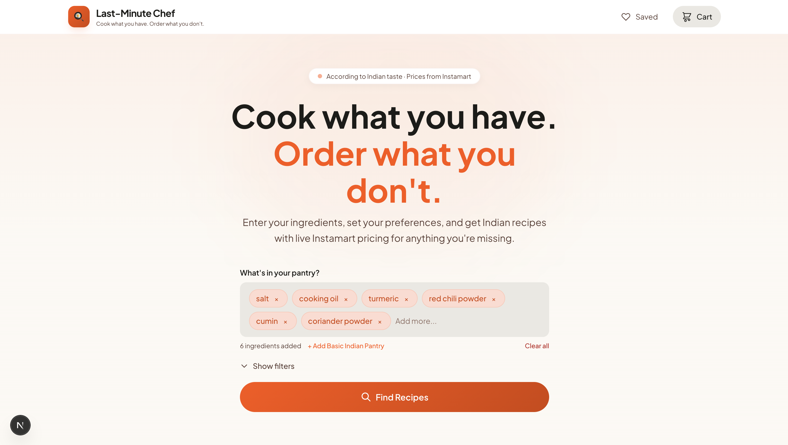
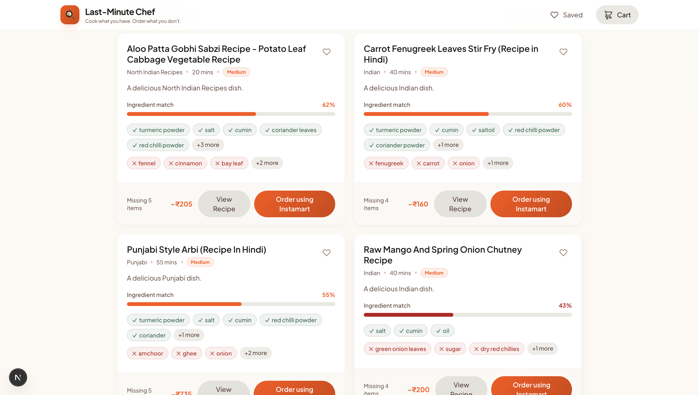
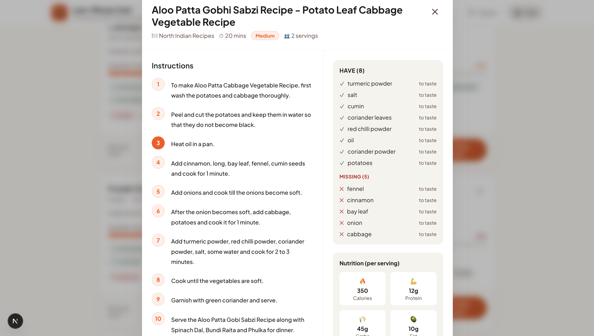

# 🍳 Last-Minute Chef

**Cook what you have. Order what you don't.**

Last-Minute Chef is an intelligent recipe discovery platform designed for the Indian household. It helps you find recipes based on the ingredients already in your pantry and provides instant estimates for anything missing, allowing you to order via Instamart integration.


## ✨ Features

- **Pantry-First Discovery**: Enter ingredients you have, and find matching Indian recipes.
- **Dual AI Engine**: 
  - **Local ML Engine**: Ultra-fast ( <20ms) similarity-based search using a dataset of 5,000+ Indian recipes.
  - **Gemini AI**: Invent creative, fusion recipes using Google's latest generative AI.
- **Smart Pantry Kits**: Quick-add common Indian spices and staples with a single click.
- **Instamart Integration**: Get real-time price estimates for missing ingredients and prepare your shopping cart.
- **Dietary Filters**: Support for Vegetarian, Vegan, Jain, and more.

## 📸 Screenshots

<div align="center">
  
  <br />
  
  <br />
  
</div>

## 🛠 Tech Stack

- **Frontend**: Next.js 15, TypeScript, Tailwind CSS
- **Backend (ML Engine)**: Python, Pandas, Scikit-learn
- **AI**: Google Gemini 2.5 Flash
- **Styling**: Modern Design System with Glassmorphism and Fluid Animations

## 🚀 Getting Started

### Prerequisites

- Node.js 18+
- Python 3.10+
- Google Gemini API Key

### 1. Set up the Backend (ML Engine)

```bash
cd backend
pip install -r requirements.txt
python recipe_server.py
```
The server will start on `http://localhost:5001`.

### 2. Set up the Frontend

```bash
# Install dependencies
npm install

# Set up environment variables
# Create a .env.local file with:
# GEMINI_API_KEY=your_api_key_here
# RECIPE_ENGINE_URL=http://localhost:5001/search

# Run the development server
npm run dev
```
Visit `http://localhost:3000` to start cooking!

